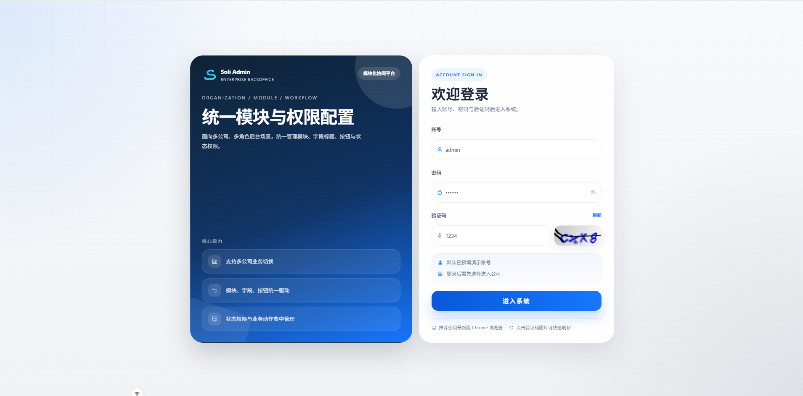
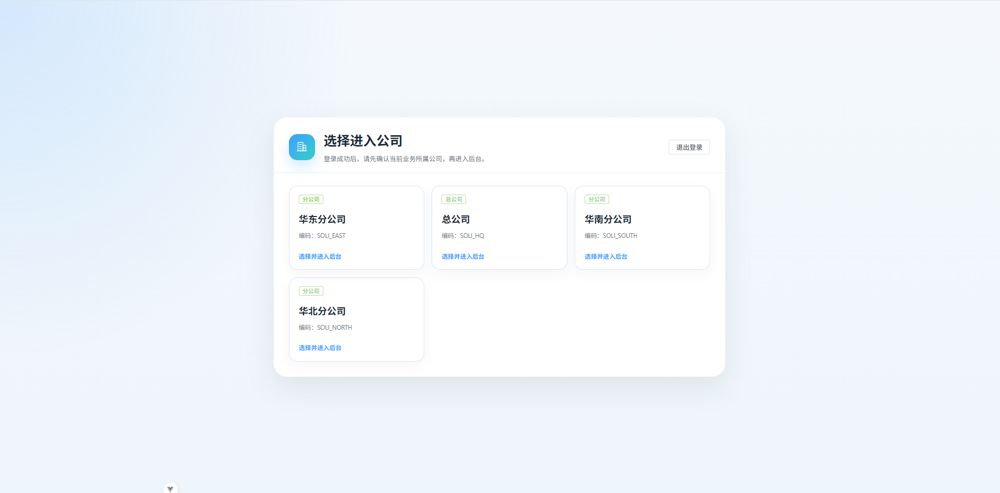
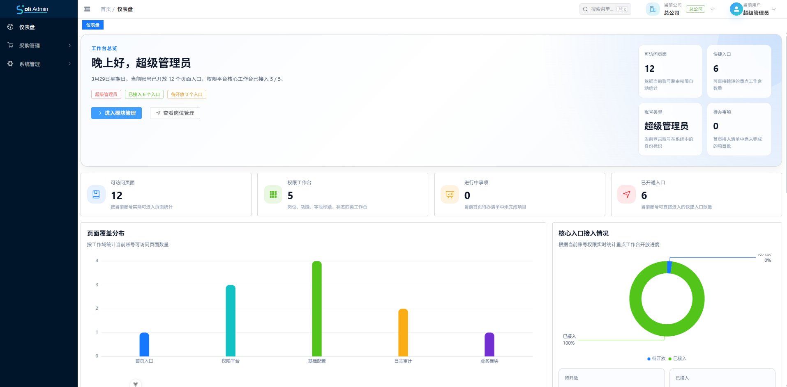
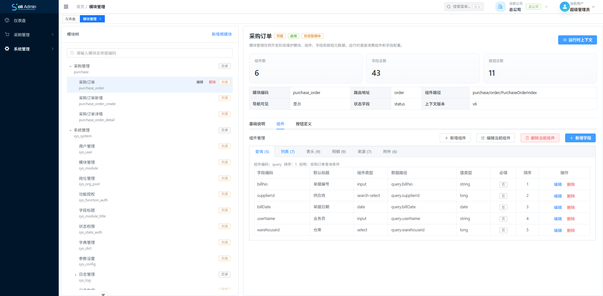
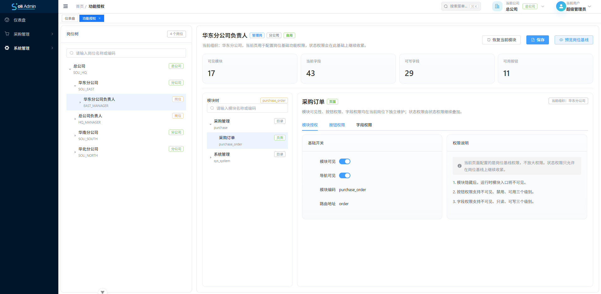
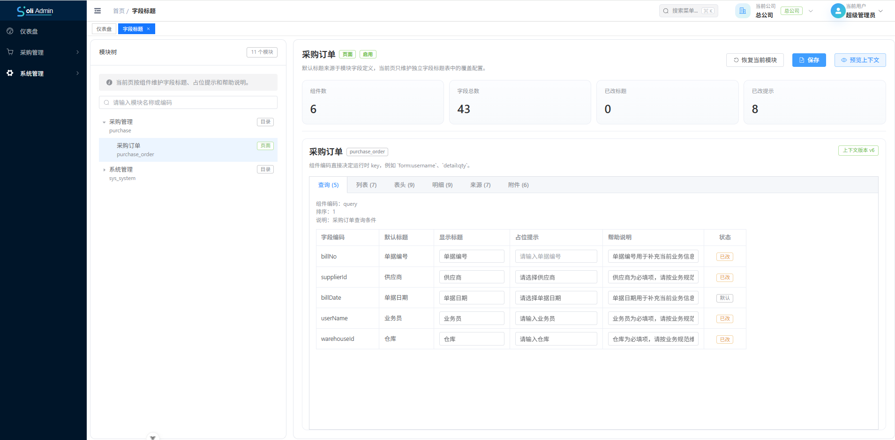
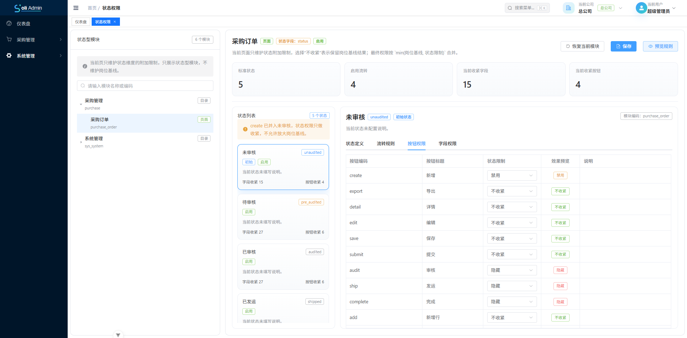
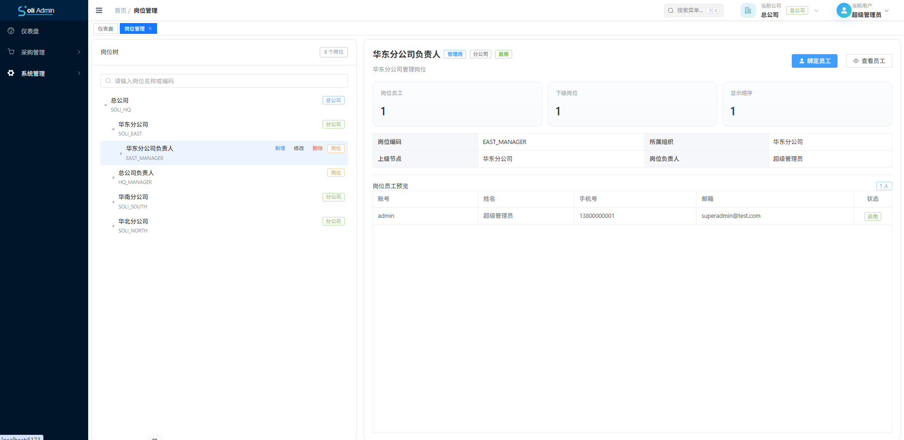

# Soli Admin

Soli Admin 是一套面向企业内部管理场景的前后端分离后台系统，重点解决的不是“菜单 + 按钮权限”这种基础后台问题，而是更复杂的业务平台能力沉淀问题：

- 模块可以统一建模
- 字段标题可以独立维护
- 字段权限可以细到组件和字段
- 状态权限可以直接驱动页面行为
- 后端直接返回模块上下文，前端不再自行拼装权限数据
- 业务模块可以按统一规范持续接入

当前仓库已经落地了登录认证、公司切换、用户管理、岗位管理、模块管理、功能授权、字段标题、状态权限、采购订单等完整能力，适合作为企业业务中后台的基础底座继续演进。

## 项目亮点

### 1. 模块上下文驱动前端

系统通过“模块 + 组件 + 字段配置”的方式描述页面，后端统一返回模块上下文，前端直接消费。字段标题、按钮权限、字段权限、状态权限不再由前端零散判断。

### 2. 字段标题独立维护

字段标题不是简单跟模块字段表做运行时关联，而是独立落表维护。开发者保存模块时即可生成字段标题数据，后续运行期直接使用字段标题表，便于扩展显示标题、占位提示、帮助文本、多语言等能力。

### 3. 权限不止菜单级别

Soli Admin 将权限拆成多层能力：

- 模块可见权限
- 按钮权限
- 字段权限
- 状态权限
- 公司与岗位上下文权限

这样可以更自然地支持审批流、单据流、不同岗位看到不同字段、不同状态允许不同操作等真实业务场景。

### 4. 业务模块可复用

采购订单模块已经把列表、表单、明细、来源、附件、操作日志、状态流转、按钮鉴权、字段标题、状态权限等能力完整串通，后续扩展销售订单、入库单、出库单、请购单会更快。

## 界面预览

### 登录与入口







### 权限与配置平台











## 适用场景

这个项目尤其适合以下类型的团队：

- 正在做 ERP、SCM、采购、供应链、财务协同等企业后台系统
- 需要“不同岗位看到不同字段、不同状态允许不同操作”的系统
- 需要多公司、多组织、多岗位权限模型的中后台
- 希望把字段标题、按钮权限、状态权限沉淀成平台能力的团队
- 想基于统一模块上下文持续扩展业务模块，而不是每次重复造后台框架的团队

## 技术栈

### 后端

- Java 21
- Spring Boot 3.5.11
- Spring Security
- MyBatis
- MySQL
- Redis
- Druid
- MapStruct
- Knife4j / OpenAPI

### 前端

- Vue 3
- TypeScript
- Vite 7
- Element Plus
- Pinia
- Vue Router
- Axios
- ECharts

## 项目结构

```text
soli-admin
├─ docs                          项目文档与截图
├─ soli-admin-backend            后端聚合工程
│  ├─ soli-admin-start           Spring Boot 启动模块
│  ├─ soli-admin-framework       认证与系统基础能力
│  ├─ soli-admin-common          公共基础模块
│  ├─ soli-admin-business        业务模块
│  └─ sql                        初始化表结构与演示数据
└─ soli-admin-frontend           Vue 3 前端工程
```

## 已实现能力

### 平台能力

- 登录认证
- JWT 鉴权
- 公司切换
- 菜单与路由权限
- 仪表盘工作台
- 通用分页查询

### 系统管理能力

- 用户管理
- 岗位管理
- 组织单元管理
- 模块管理
- 功能授权
- 字段标题管理
- 状态权限管理
- 字典管理
- 参数配置
- 操作日志与登录日志

### 业务能力

- 采购订单列表
- 采购订单新增
- 采购订单详情
- 采购订单状态流转
- 采购订单按钮权限控制
- 采购订单字段标题与状态权限对接
- 采购订单明细、来源、附件、操作日志联动

## 快速启动

### 环境要求

- JDK 21
- Maven 3.9+
- Node.js 20+
- MySQL 8.x
- Redis 7.x

### 1. 初始化数据库

先创建数据库：

```sql
create database `soli-admin` default character set utf8mb4 collate utf8mb4_general_ci;
```

然后按顺序执行以下脚本：

- `soli-admin-backend/sql/init_Table.sql`
- `soli-admin-backend/sql/init_Data.sql`

### 2. 启动后端

默认配置文件位于 `soli-admin-backend/soli-admin-start/src/main/resources/application.yml`，当前默认配置如下：

- MySQL：`jdbc:mysql://localhost:3306/soli-admin`
- 数据库账号：`root`
- 数据库密码：`root`
- Redis：`localhost:6379`
- 后端地址：`http://localhost:8080`

启动命令：

```bash
cd soli-admin-backend
mvn clean install
mvn -pl soli-admin-start spring-boot:run
```

### 3. 启动前端

前端开发环境通过 Vite 代理 `/api` 到 `http://localhost:8080`。

启动命令：

```bash
cd soli-admin-frontend
npm install
npm run dev
```

默认访问地址：

- 前端首页：`http://localhost:5173`
- 后端接口：`http://localhost:8080`

### 4. 默认账号

- 超级管理员：`admin / 123456`
- 示例用户：`zhangsan / 123456`
- 示例用户：`lisi / 123456`
- 示例用户：`wangwu / 123456`

首次登录后可以体验公司切换、仪表盘、采购订单、模块管理、功能授权、字段标题、状态权限等模块。

## 为什么值得试用

传统后台大多只能解决：

- 菜单权限
- 按钮权限
- 简单 CRUD

Soli Admin 更适合承载复杂业务后台，因为它已经把下面这些最容易反复重写的基础能力提前沉淀好了：

- 模块级建模
- 组件级字段配置
- 字段标题独立维护
- 后端统一生成模块上下文
- 状态驱动权限控制
- 多岗位、多公司、多组织协同

如果你的团队要做的是企业级业务单据系统，而不是纯展示型后台，这套基础能力会比普通管理后台模板更有价值。

## 推荐体验路径

建议按下面顺序体验这个项目：

1. 登录系统，先完成公司切换
2. 查看仪表盘核心入口与接入概览
3. 进入采购订单，观察列表、表单、明细、状态流转和按钮权限
4. 进入模块管理，查看模块、组件、字段配置
5. 进入字段标题，查看字段展示信息如何独立维护
6. 进入功能授权和状态权限，观察岗位权限与状态权限如何共同生效
7. 回到用户管理和岗位管理，体验组织权限模型的落地方式

## 后续可扩展方向

- 销售订单
- 请购单
- 入库单 / 出库单
- 审批流引擎
- 多语言字段标题
- 更细粒度的数据权限
- 文件存储与附件中心

## 说明

当前仓库已经具备较强的业务平台化基础，但它不是“开箱即用的 SaaS 成品”，更适合作为企业内部管理系统、供应链系统、采购系统、中后台平台的基础工程继续扩展。
